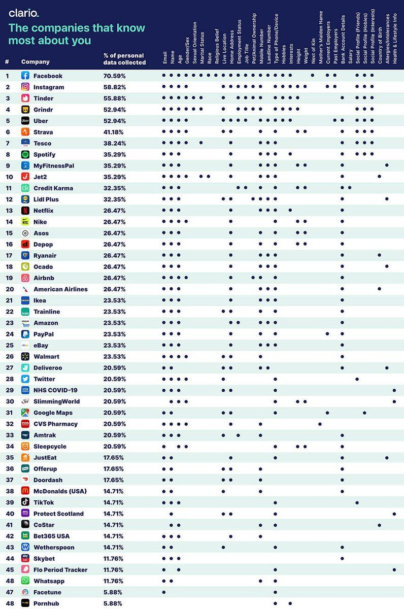

# [Czym jest autoinwigilacja?](https://www.autoinwigilacja.pl/)

+ [Auto Inwigilacja - AutoInwigilacja.pl](https://autoinwigilacja.github.io/www/#/)

Czym jest autoinwigilacja?

## Metadane
Wszystko co robimy w sieci jest zapisywane i analizowane.
Nawet samo przeglądanie tak jak telefonowanie zostawia ślad - metadane.


## Social media
Udostępniamy zdjęcia, komentarze, dane personalne na serwisach społecznościowych
opowiadamy o przeszłosci, przyszłości i o tym co w danej chwili robimy... ale to nie wszystko.


---
+ [edit](https://github.com/autoinwigilacja/www/edit/main/README.md)
+ [git](https://github.com/autoinwigilacja/www)
```
https://github.com/autoinwigilacja/www.git
```
